**Installing WSL2, ROS, and Mushr**

***Setup and Install WSL2***

1. Steps for Installing/Enabling Windows Subsystem for Linux 2 (WSL2): (https://docs.microsoft.com/en-us/windows/wsl/install-win10)
   
   1. Right-click on the Start button in the taskbar and select 'Run':

      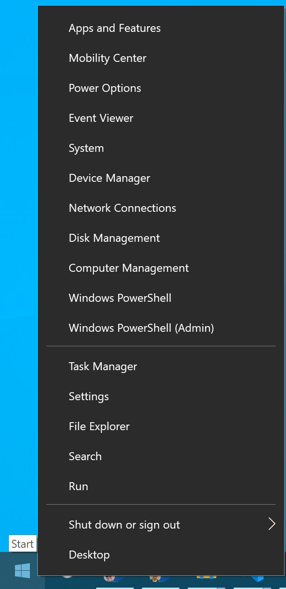
   
   2. Type 'winver', without single quotes, into the 'Open:' textbox:

      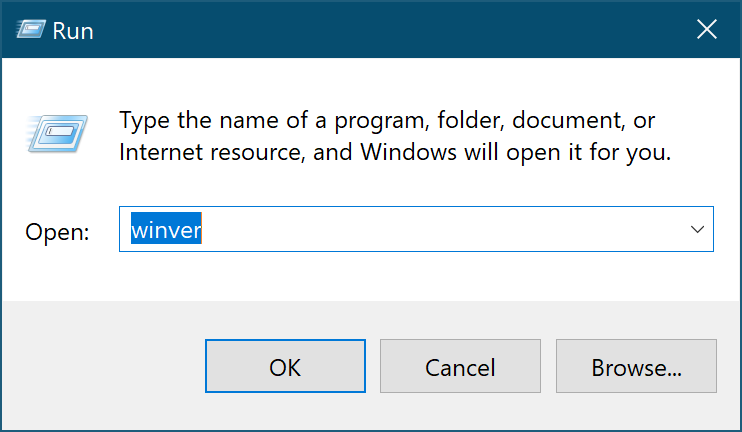
   
   3. Verify that your Windows Version meets the below requirements:

      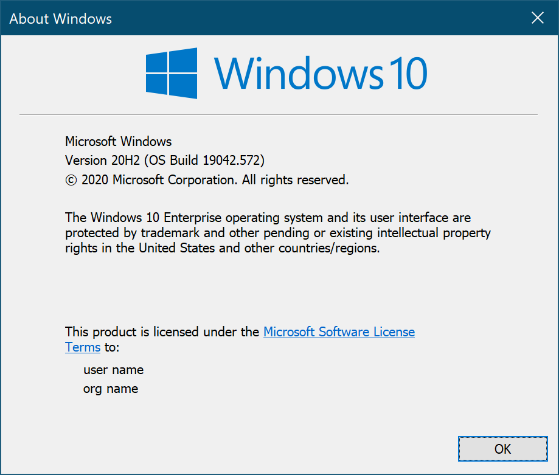
   
      1. Version 1903 or higher, with Build 18362 or higher is required for WSL2
   
   4. Open PowerShell as Admin 

      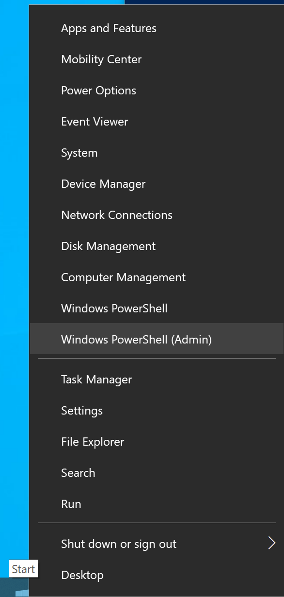

      1. Install WSL in Windows:

         1. Type in and run the following in the PowerShell administrator console widow: 

                dism.exe /online /enable-feature /featurename:Microsoft-Windows-Subsystem-Linux /all /norestart
   
      2. Install Virtual Machine Plaform in Windows:

         1. Type in and run the following in the PowerShell administrator console widow: 
         
                dism.exe /online /enable-feature /featurename:VirtualMachinePlatform /all /norestart
   
      3. Set WSL2 as the default WSL:

         1. Type in and run the following in the PowerShell administrator console widow: 

                wsl --set-default-version 2

      4. Update the WSL2 Linux kernel: (https://docs.microsoft.com/en-us/windows/wsl/wsl2-kernel)

         1. Download and install the following .msi for AMD64 systems: (https://wslstorestorage.blob.core.windows.net/wslblob/wsl_update_x64.msi)

***Setup and Install Ubuntu 18.04 LTS***

1. Open Edge and search the Micoroft Store for Ubuntu 18.04 LTS: (https://www.microsoft.com/en-us/p/ubuntu-1804-lts/9n9tngvndl3q?cid=msft_web_chart)
   
   1. Select 'Get' and then 'Open' to open the Microsoft Store

      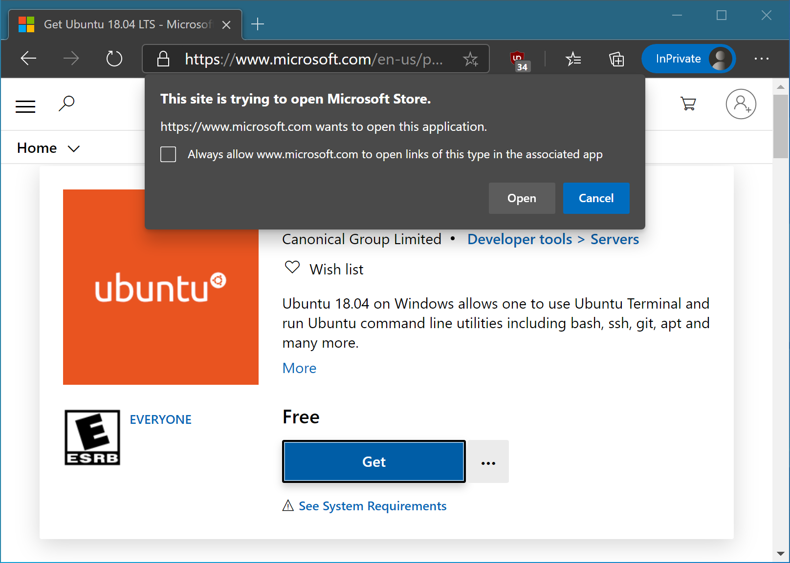

   2. The Microsoft Store should pull up Ubuntu 18.04 LTS.  Select 'Install':

      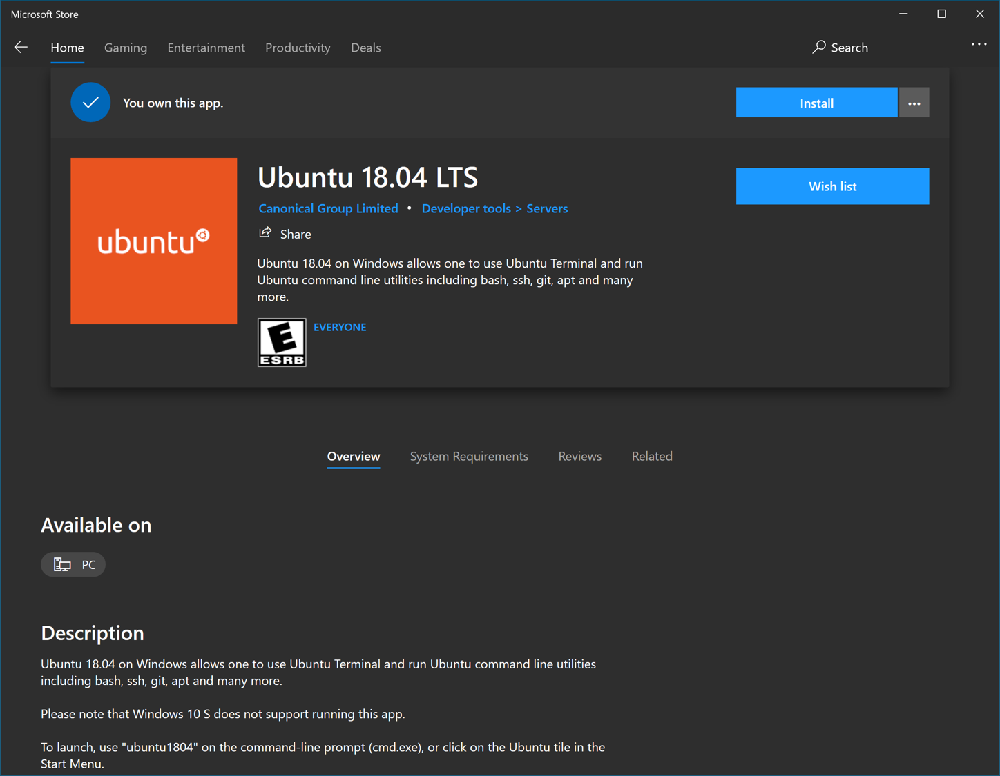
   
   3. Open Ubuntu 18.04 LTS from the Start Menu in Windows to setup the Ubuntu username and password:

      

***Setup and Install VcXsrV***
   
1. Open Edge (or any browser) and download and install VcXsrv: (https://sourceforge.net/projects/vcxsrv/)

2. The following images are the recommended default settings for setup.  More detailed instructions can be found here (https://janbernloehr.de/2017/06/10/ros-windows#install-vcxsrv) and here (https://jack-kawell.com/2020/06/12/ros-wsl2/)

   1. Setup the display settings to that each application from Ubuntu opens in a separate, new window in Windows:

      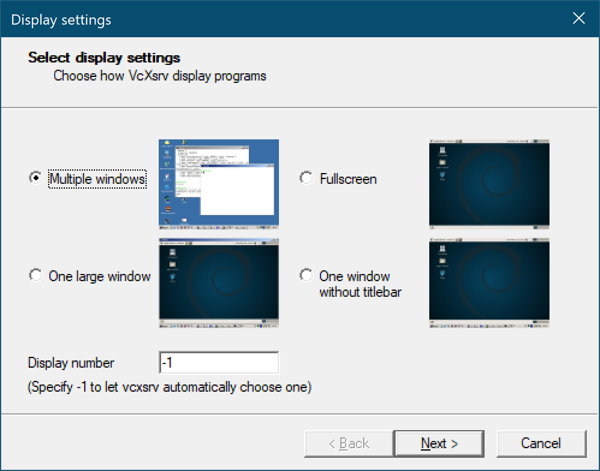

   2. Do not start a client via VcXsrv, as Ubuntu starts this communication path:

      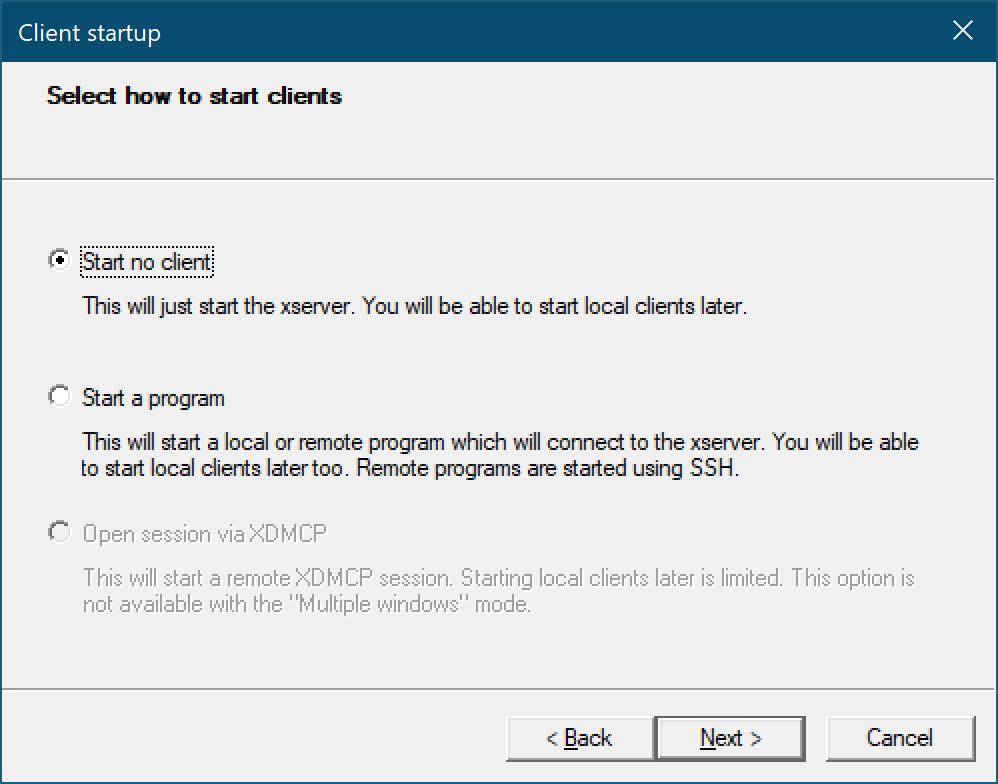

   3. Use these 'Extra Settings':

      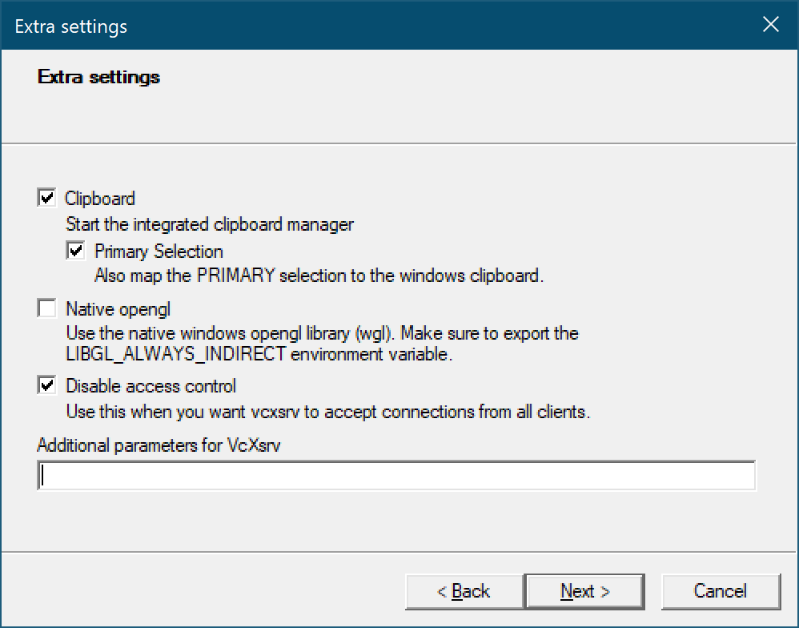

   4. Select the 'Save configuration' button to save a shortcut to run VcXsrv with the settings selected in previous windows:

      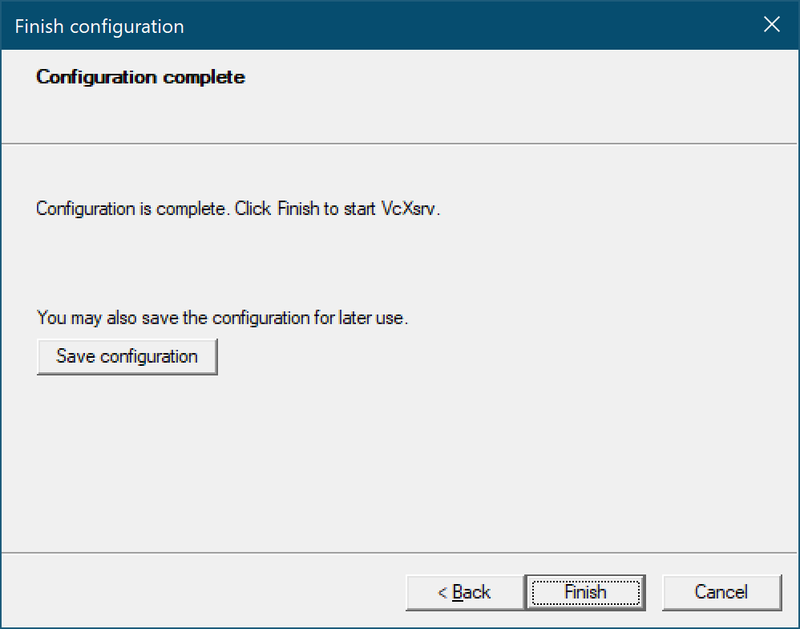

   5. ***(Optional)*** You may save the configuration, a shortcut, to the Start Menu folder in order "Pin' the shortcut to the Start Menu.

      1. The Start Menu folder can be accessed by opening Windows explorer and typing the following into the address bar

           %USERPROFILE%\AppData\Roaming\Microsoft\Windows\Start Menu\Programs

         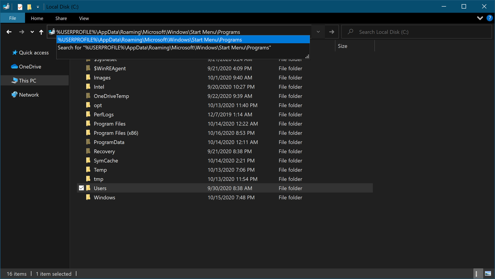

      2. Place the shortcut, or configuration file, into this Start Menu folder.  *Username* should match the user name of your account on your Windows machine.

         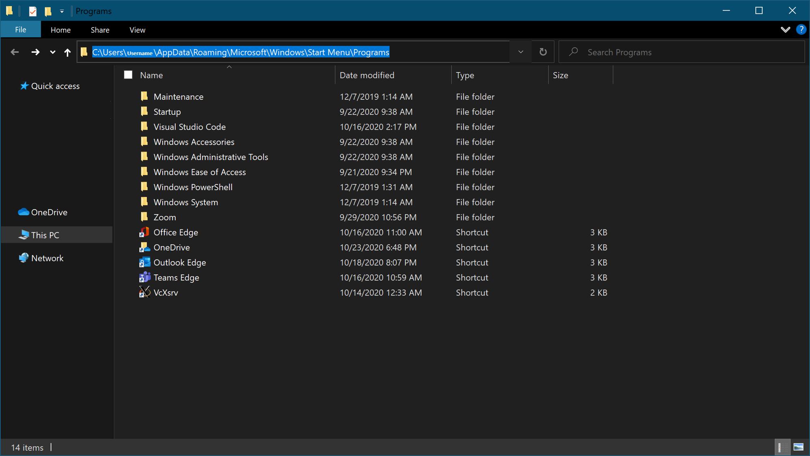
      
      3. Open the Start Menu app list and 'Pin to Start' the VcXsrv icon that should be visible now
         
***Test VcXsrv With Ubuntu 18.04 LTS***

1. Run VcXsrv by double-clicking the shortcut, or configuration file, created in the previous steps.  If the optional steps were taken to place the shortcut in the Start Menu, click on the icon in the Start Menu.  A VcXsrv icon should appear in the notification area of the Taskbar.

2. Open Ubuntu 18.04 LTS from the Start Menu in Windows

   1. Type in and run the following in the Ubuntu console window: 

           echo "export DISPLAY=:0" >> ~/.bashrc

   2. Type in and run the following in the Ubuntu console window: 

        export LIBGL_ALWAYS_INDIRECT=0 >> ~/.bashrc

   3. SourceType in and run the following in the Ubuntu console window: 

           source ~/.bashrc
   
   4. Ensure Debian package index is up-to-date.  Type in and run the following in the Ubuntu console window:

           sudo apt update

   5. Ensure Debian packages are up-to-date.  Accept to update all packages, if prompted to.  Type in and run the following in the Ubuntu console window:

           sudo apt upgrade

   6. Test out if VcXsrv and Ubuntu are properly configured.  Type in and run the following in the Ubuntu console window: 

           xmessage -center "hello"

   7. A VcXsrv window should open, meaning VcXsrv and Ubuntu are setup correctly.
         
      

***Setup and Install ROS Melodic on Ubuntu 18.04 LTS***

1. This follows the guide from ROS exactly, but will be copied here for completeness (http://wiki.ros.org/melodic/Installation/Ubuntu)

2. Open Ubuntu 18.04 LTS from the Start Menu in Windows

   1. Setup sources.list.  Type in and run the following in the Ubuntu console window:

           sudo sh -c 'echo "deb http://packages.ros.org/ros/ubuntu $(lsb_release -sc) main" > /etc/apt/sources.list.d/ros-latest.list'

   2. Set up keys.  Type in and run the following in the Ubuntu console window:

           sudo apt-key adv --keyserver 'hkp://keyserver.ubuntu.com:80' --recv-key C1CF6E31E6BADE8868B172B4F42ED6FBAB17C654

   3. Ensure Debian package index is up-to-date.  Type in and run the following in the Ubuntu console window:

           sudo apt update

   4. Install Desktop-Full Install (This may take a while, ~30 minutes).  Type in and run the following in the Ubuntu console window:

           sudo apt install ros-melodic-desktop-full

   5. Environment Setup.  Type in and run the following in the Ubuntu console window:
   6. 
           echo "source /opt/ros/melodic/setup.bash" >> ~/.bashrc
   
   7. Source the bash config file.  Type in and run the following in the Ubuntu console window:
            
           source ~/.bashrc

   8. Install tools required for building ROS packages.  

           sudo apt install python-rosdep python-rosinstall python-rosinstall-generator python-wstool build-essential
      
   9. Install rosdep to use ros tools.  Type in and run the following in the Ubuntu console window:

           sudo apt install python-rosdep

   10. Initialize rosdep.  Type in and run the following in the Ubuntu console window:

           sudo rosdep init

   11. Update rosdep.  Type in and run the following in the Ubuntu console window:

           rosdep update

***Setup and Install Mushr Ubuntu 18.04 LTS***

1. Open Ubuntu 18.04 LTS from the Start Menu in Windows

   1. Install git.  Type in and run the following in the Ubuntu console window:

           sudo apt install git-all

   2. Install tkinter.  Type in and run the following in the Ubuntu console window:

           sudo apt install python-tk
        
   3. Install pip for Python 2.  Type in and run the following in the Ubuntu console window:

           sudo apt install python-pip

   4. Install Cython.  Type in and run the following in the Ubuntu console window:

           sudo pip install Cython 

   5. Install VCS.  Type in and run the following in the Ubuntu console window:

           sudo pip install vcstool
        
   6. Create a catkin workspace directory.  Type in and run the following in the Ubuntu console window:

           mkdir -p ~/catkin_ws/src

   7. Move to the catkin folder created. Type in and run the following in the Ubuntu console window:

           cd ~/catkin_ws/

   8.  Build/make the catkin workspace in ~/catkin_ws.  Type in and run the following in the Ubuntu console window:

           catkin_make

   9.  Move to the src folder in the newly-created catkin workspace.

           cd ~/catkin_ws/src

   10. Download the mushr repros into the ~/catkin_ws/src folder.  

           wget https://mushr.io/tutorials/quickstart/repos.yaml

   11. Clone the Mushr repos in repos.yaml using vcs.

           vcs import < repos.yaml

   12. Move realsense description folder.

           mv ~/catkin_ws/src/mushr/mushr_hardware/realsense/realsense2_description ~/catkin_ws/src/mushr/mushr_hardware/realsense2_description

   13. Remove the rest of the realsense files.

           rm -rf ~/catkin_ws/src/mushr/mushr_hardware/realsense

   14. Go to the rangelibc python folder.  

           cd ~/catkin_ws/src/range_libc/pywrapper

   15. Install range_libc with python.

           sudo python setup.py install

   16. Remove range_libc directory from the catkin workspace folder

           rm -rf ~/catkin_ws/srcrange_libc

   17. Go back to the root of the catkin workspace

           cd ~/catkin_ws

   18. Rebuild/make the catkin workspace

           catkin_make

   19. Setup the default Mushr rviz environment

           cp ~/catkin_ws/src/mushr/mushr_utils/rviz/default.rviz ~/.rviz/

   20. Verify the setup is valid by running the Mushr simulation.  

           roslaunch mushr_sim teleop.launch

   21. Try running rviz in another terminal tab.

           rviz

***(Optional) Setup and Install Visual Studio Code for WSL2 Ubuntu 18.04 LTS***

1. Download and install Visual Studio Code (VS Code): (https://code.visualstudio.com/)

   1. (Optional) Install git (https://git-scm.com/downloads)

   2. Use default options, but choose VS Code as the default code editor.

2. Open VS Code.  

   1. Press '*Ctrl + Shift + X*' to open the extensions tab.

   2. Install the Remote-WSL extension (ms-vscode-remote.remote-wsl)

      1. VS Code should automatically detect the Ubuntu 18.04 LTS remote environment and set it up for you.  Accept the default settings.

         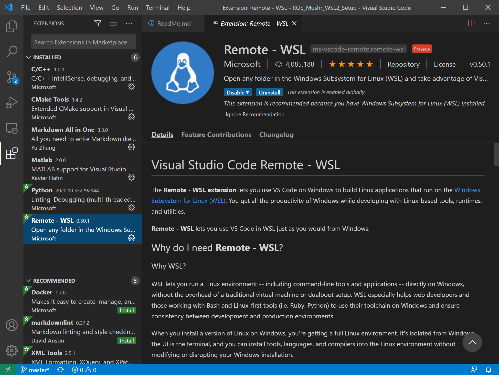

   3. Press '*Ctrl + Shift + P*' to open the Command Pallet

      1. Type in the following option '*Open Folder in WSL ...*'

         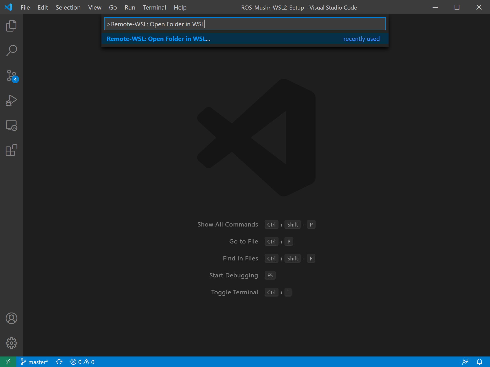

      2. Select the catkin workspace folder:

         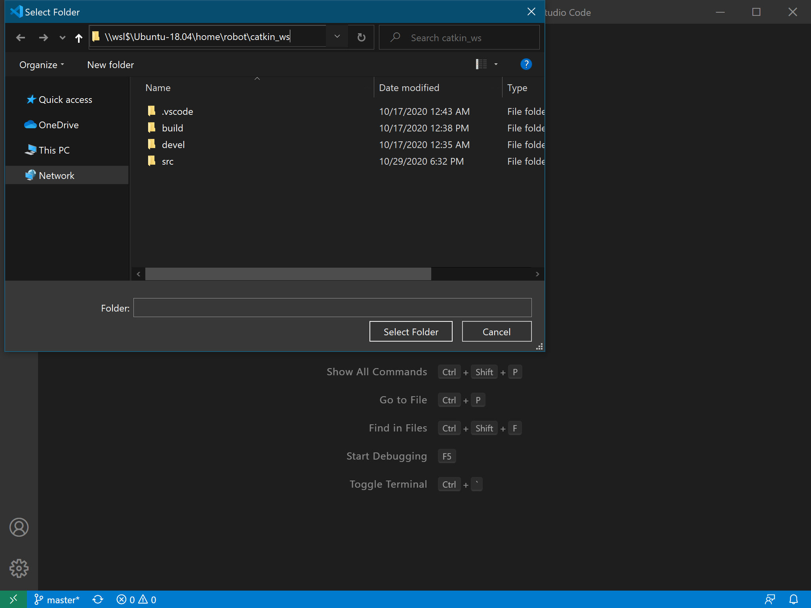

                \\wsl$\Ubuntu-18.04\home\robot\catkin_ws

   4. Press '*Ctrl + Shift + '*' to open the Terminal

      1. This should open the catkin_ws folder in the Ubuntu environment.

   5. Install the Microsoft Python extension (ms-python.python)

      1. Optionally install the following extensions for working with other files.

         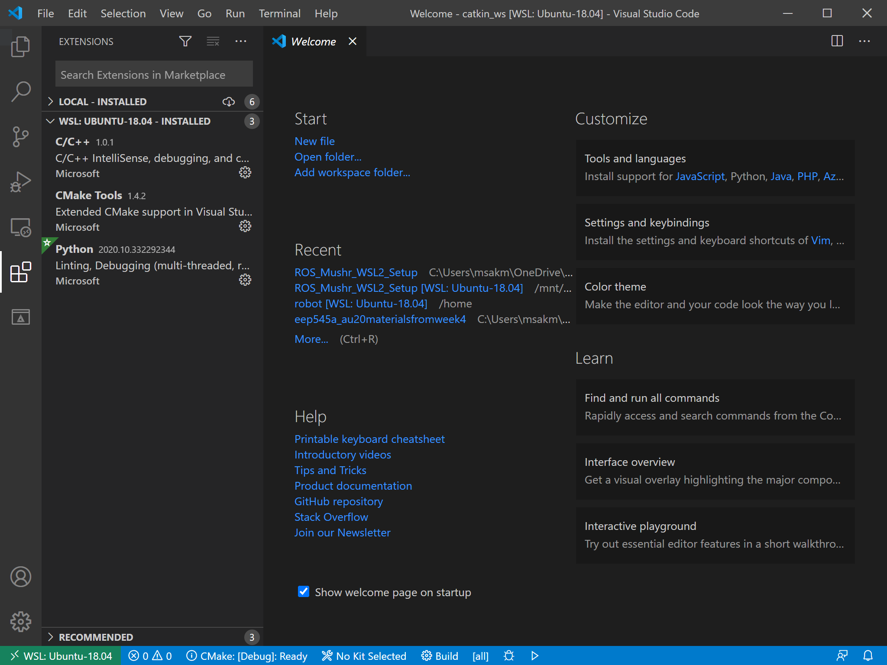

      2. Open one of the python files from Mushr and ensure the right Python interpreter is used (Python 2.7)

         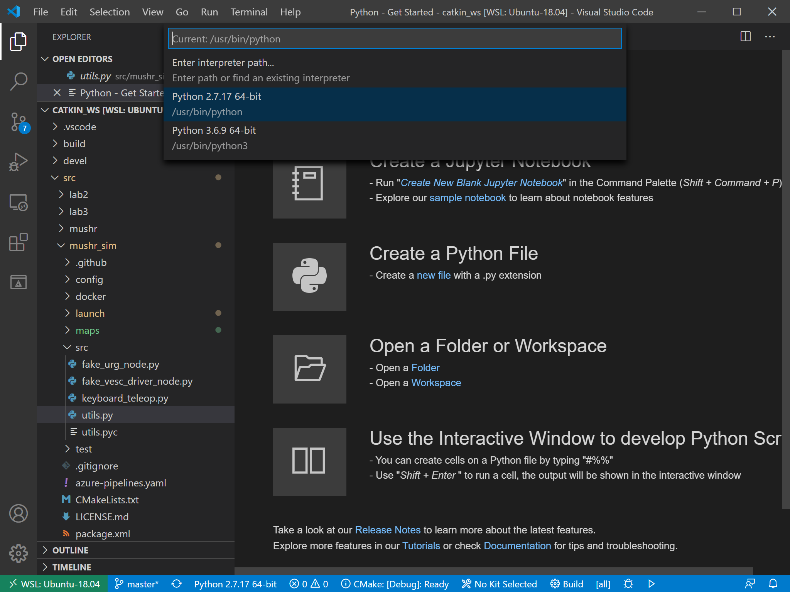

***(Optional and Your Mileage May Vary) Setup For EEP 545 AU20 Class***

1. Rename the ~/catkin_ws folder created in the above steps to something else, such as '*catkin_ws_rebuilt*'

                mv ~/catkin_ws ~/catkin_ws_rebuilt

2. Move to ~/ folder.  Type in and run the following in the Ubuntu console window:

                cd ~/

3. Clone the catkin_ws_VM_original folder from github and rename your newly-created catkin_ws folder.  Open a terminal in VS Code WSL: Ubuntu 18.04 or open the Ubuntu 18.04 LTS console window from the Start Menu, type in and run the following:

                git clone https://github.com/msakmar/UW_EEP545-AU20_WSL2-ROS-Mushr-Setup.git

4. Rename the catkin_ws_original folder to catkin_ws.  Type in and run the following in the Ubuntu console window:

                mv ~/UW_EEP545-AU20_WSL2-ROS-Mushr-Setup/catkin_ws_VM_original ~/caktin_ws

5. Remove the rest of the UW_EEP545-AU20_WSL2-ROS-Mushr-Setup folder.  Type in and run the following in the Ubuntu console window:

                rm -dir -f ~/UW_EEP545-AU20_WSL2-ROS-Mushr-Setup

6. Change directories to ~/catkin_ws

                cd ~/catkin_ws

7. Rebuild/remake the catkin workspace.  Type in and run the following in the Ubuntu console window:

                catkin_make