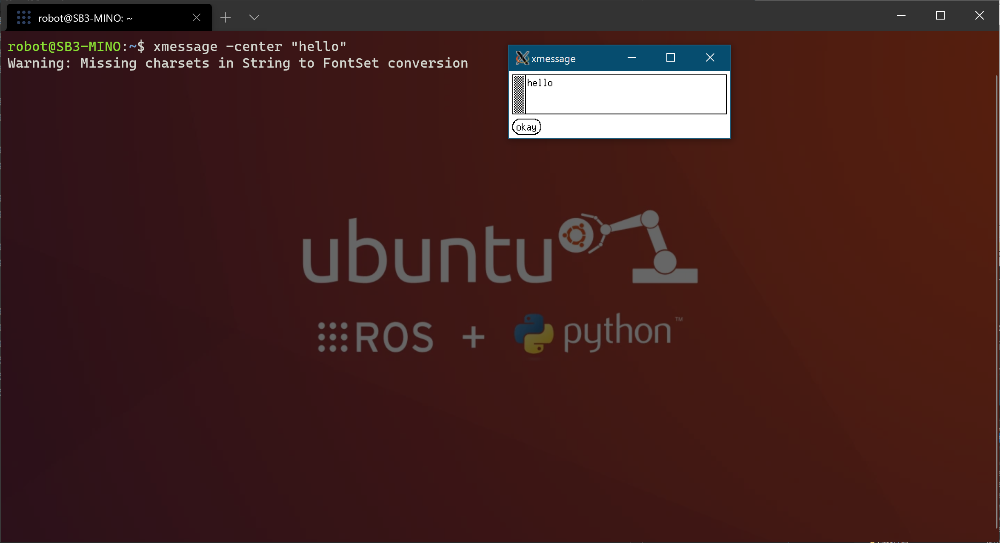

**Installing WSL2, ROS, and Mushr**

***Setup and Install WSL2***

1. Steps for Installing/Enabling Windows Subsystem for Linux 2 (WSL2): (https://docs.microsoft.com/en-us/windows/wsl/install-win10)
   
   1. Right-click on the Start button in the taskbar and select 'Run':

      
   
   2. Type 'winver', without single quotes, into the 'Open:' textbox:

      
   
   3. Verify that your Windows Version meets the below requirements:

      
   
      1. Version 1903 or higher, with Build 18362 or higher is required for WSL2
   
   4. Open PowerShell as Admin 

      

      1. Install WSL in Windows:

         1. Type in and run the following in the PowerShell administrator console widow: 

                  dism.exe /online /enable-feature /featurename:Microsoft-Windows-Subsystem-Linux /all /norestart
   
      2. Install Virtual Machine Plaform in Windows:

         1. Type in and run the following in the PowerShell administrator console widow: 
         
                  dism.exe /online /enable-feature /featurename:VirtualMachinePlatform /all /norestart
   
      3. Set WSL2 as the default WSL:

         1. Type in and run the following in the PowerShell administrator console widow: 

                  wsl --set-default-version 2

      4. Update the WSL2 Linux kernel: (https://docs.microsoft.com/en-us/windows/wsl/wsl2-kernel)

         1. Download and install the following .msi for AMD64 systems: (https://wslstorestorage.blob.core.windows.net/wslblob/wsl_update_x64.msi)

***Setup and Install Ubuntu 18.04 LTS***

1. Open Edge and search the Micoroft Store for Ubuntu 18.04 LTS: (https://www.microsoft.com/en-us/p/ubuntu-1804-lts/9n9tngvndl3q?cid=msft_web_chart)
   
   1. Select 'Get' and then 'Open' to open the Microsoft Store

      

   2. The Microsoft Store should pull up Ubuntu 18.04 LTS.  Select 'Install':

      
   
   3. Open Ubuntu 18.04 LTS from the Start Menu in Windows to setup the Ubuntu username and password:

      

***Setup and Install VcXsrV***
   
   1. Open Edge (or any browser) and download and install VcXsrv: (https://sourceforge.net/projects/vcxsrv/)
   
   2. The following images are the recommended default settings for setup.  More detailed instructions can be found here (https://janbernloehr.de/2017/06/10/ros-windows#install-vcxsrv) and here (https://jack-kawell.com/2020/06/12/ros-wsl2/)

      1. Image 1

         

      2. Image 2

         

      3. Image 3

         

      4. Image 4

         

      5. ***(Optional)*** You may save the configuration, a shortcut, to the Start Menu folder in order "Pin' the shortcut to the Start Menu.  

         1. The Start Menu folder can be accessed by opening Windows explorer and typing the following into the address bar

                  %USERPROFILE%\AppData\Roaming\Microsoft\Windows\Start Menu\Programs

            

         2. Place the shortcut, or configuration file, into this Start Menu folder.  *Username* should match the user name of your account on your Windows machine.

            
         
         3. Open the Start Menu app list and 'Pin to Start' the VcXsrv icon that should be visible now
         
***Test VcXsrv With Ubuntu 18.04 LTS***

   1. Run VcXsrv by double-clicking the shortcut, or configuration file, created in the previous steps.  If the optional steps were taken to place the shortcut in the Start Menu, click on the icon in the Start Menu.  A VcXsrv icon should appear in the notification area of the Taskbar.
   
   2. Open Ubuntu 18.04 LTS from the Start Menu in Windows

   3. Type in and run the following in the Ubuntu console window: 

            echo "export DISPLAY=:0" >> ~/.bashrc

   4. Type in and run the following in the Ubuntu console window: 

            export LIBGL_ALWAYS_INDIRECT=0 >> ~/.bashrc

   5. SourceType in and run the following in the Ubuntu console window: 

            source ~/.bashrc
   
   6. Type in and run the following in the Ubuntu console window: 

            sudo apt update

   7. Type in and run the following in the Ubuntu console window: 

            sudo apt upgrade

   8. Type in and run the following in the Ubuntu console window: 

            xmessage -center "hello"

   9. A VcXsrv window should open, meaning VcXsrv and Ubuntu are setup correctly.
         
      

   10. (http://wiki.ros.org/melodic/Installation/Ubuntu)

***Setup and Install ROS Melodic on Ubuntu 18.04 LTS***

   1. This follows the guide from ROS exactly, but will be copied here for completeness (http://wiki.ros.org/melodic/Installation/Ubuntu)

   2. Setup sources.list

            sudo sh -c 'echo "deb http://packages.ros.org/ros/ubuntu $(lsb_release -sc) main" > /etc/apt/sources.list.d/ros-latest.list'
   
   3. Set up keys

            sudo apt-key adv --keyserver 'hkp://keyserver.ubuntu.com:80' --recv-key C1CF6E31E6BADE8868B172B4F42ED6FBAB17C654

   4. Ensure Debian package index is up-to-date:

            sudo apt update

   5. Install Desktop-Full Install:

            sudo apt install ros-melodic-desktop-full

   6. Environment Setup:

            echo "source /opt/ros/melodic/setup.bash" >> ~/.bashrc
   
   7. Source 
            
      source ~/.bashrc

